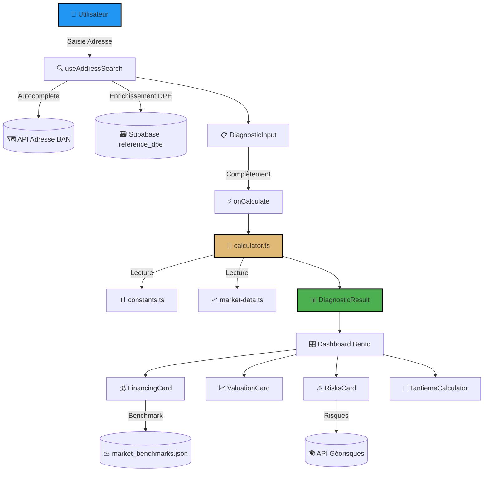
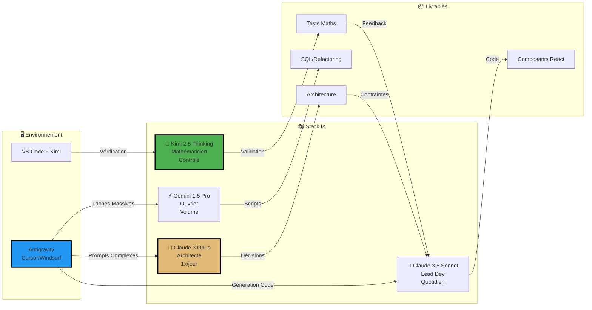

# 🧬 LE CENTRE — Bible ADN Valo-Syndic
> **Version :** Bêta 2026  
> **Date :** 31 Janvier 2026  
> **Statut :** Mémo interne vivant — Le repo change, ce doc aussi  
> **Devise :** *"Code is Law"* — Interdiction formelle de mentir via le code

---

## 🎯 PITCH — Pourquoi Valo-Syndic existe

**Le problème :** Les syndics de copropriété perdent des votes en Assemblée Générale parce qu'ils ne savent pas expliquer les chiffres. Un devis de 300k€ pour la rénovation énergétique ? C'est intimidant.

**La solution :** Un calculateur qui transforme "300k€" en "47€/mois pour votre lot" — avec toutes les aides (MaPrimeRénov', Éco-PTZ à 0%) et la valeur verte de l'immeuble.

**En 60 secondes**, le gestionnaire génère un rapport PDF + des slides PowerPoint pour convaincre l'AG. En bonus, une extension Chrome aspire automatiquement les données depuis l'ERP du syndic.

**La promesse :** Zéro copropriétaire laissé sur le bord de la route parce qu'il n'a pas compris le financement.

---

## ⚠️ AVERTISSEMENT CRITIQUE — NE PAS SUPPRIMER

> **Ce document est la mémoire unique et centralisée du projet.**
> 
> **EN AUCUN CAS ce fichier ne doit être supprimé ou déplacé.**  
> Il sert de référence absolue pour :
> - La compréhension de l'architecture
> - L'onboarding de nouveaux développeurs
> - La maintenance à long terme
> - La prise de décision sur les évolutions
> 
> **Si vous lisez ceci après 2026 et que ce fichier est obsolète :** mettez-le à jour, ne le supprimez pas.

---

## 🤖 MESSAGE POUR LES IA (LLM/Agents)

> **Si vous êtes une IA (Claude, Kimi, GPT, etc.) modifiant ce codebase :**
> 
> 1. **LISEZ ce document AVANT toute modification**
> 2. **Maintenez ce document à jour** si vous changez :
>    - L'architecture (§3)
>    - Les composants UI (§5, §10)
>    - La stack technique (§7)
>    - Les constantes métier (§3.2)
> 3. **NE SUPPRIMEZ PAS ce fichier** — mettez-le à jour
> 4. **Respectez la philosophie** "Code is Law" (§1)
> 5. **Ajoutez vos modifications** à la section "Changelog" en bas du document
> 
> **Pour toute question :** ce document est la source de vérité. Si vous ne comprenez pas quelque chose, cherchez ici d'abord.

---

# 📋 SOMMAIRE EXPLIQUÉ

| Section | Contenu | Pour qui ? |
|---------|---------|------------|
| **1. Identité & Philosophie** | Le "pourquoi", la vision produit, le Design System "Stealth Wealth" | Tout le monde (lire en premier) |
| **2. Momentum d'Usage** | Les 3 moments clés : Avant/Durant/Après l'AG | Équipe produit, Sales |
| **3. Architecture** | Le moteur de calcul, flux de données, fichiers clés | Développeurs, Tech Leads |
| **4. Data Layer** | Sources de données (APIs, Supabase), ingestion via extension | Backend, Data Engineers |
| **5. UI Bento** | Les composants React, module "Avocat du Diable" | Frontend, UX/UI |
| **6. Livrables** | PDF, PowerPoint AG, les 3 formules KPI | Produit, Sales, Marketing |
| **7. Stack Technique** | Next.js, TypeScript, Supabase, outils | Développeurs, DevOps |
| **8. Sécurité & GDPR** | Principe "Local First", anonymisation | Security, Legal |
| **9. Infrastructure SQL** | Schémas Supabase, vues matérialisées | Backend, DBA |
| **10. Catalogue Widgets** | Liste détaillée de tous les composants UI | Frontend |
| **11. Workflow AI** | Comment on code avec Claude/Gemini/Kimi | Tous les développeurs |
| **12. Roadmap** | V2.1 → V3 → V4, la feuille de route | Produit, Management |
| **13. Annexe** | Tous les fichiers du repo catalogués | Référence technique |
| **14. Gestion Docs** | Quels .md conserver/supprimer | Maintenance |

**Conseil de lecture :**
- **Nouveau sur le projet ?** → Lire §1, §2, §6, puis §3
- **Développeur frontend ?** → §5, §7, §10
- **Développeur backend ?** → §3, §4, §8, §9
- **Tech Lead ?** → Tout lire, mais §3, §7, §11 en priorité

---

# 1. IDENTITÉ & PHILOSOPHIE

## 1.1 Définition Produit
**Valo-Syndic** est un **moteur d'ingénierie financière B2B** pour la rénovation énergétique en copropriété.

| Aspect | Description |
|--------|-------------|
| **Nom de code** | "Le Cheval de Troie" (The Trojan Horse) |
| **Positionnement** | L'anti-vendeur de rêve. On ne vend pas des "économies magiques", mais de la **sécurité patrimoniale** |
| **Objectif caché** | Infiltrer le marché des Syndics (Tapissier, Soclova, Citya) avec une technologie supérieure qui "close" les votes en AG |

## 1.2 Le Problème (Pain Point)
Le **Syndic** ne maîtrise pas l'ingénierie financière (Aides + Prêts + Fiscalité) et ne sait pas produire un plan de financement individuel pour ses copropriétaires. Il craint de proposer des travaux car les coûts semblent insupportables et les aides opaques.

## 1.3 La Solution
Un **générateur de "Preuves Financières"** (PDF/Rapport) qui transforme la dépense en investissement sécurisé via un calcul de **"Reste à charge" bancable**.

> Le PDF n'est pas un rapport, c'est un **bon de commande déguisé en audit**.

## 1.4 Cible
- **Gestionnaires de copropriété**
- **Directeurs d'agence/Immobilier**

## 1.5 La Philosophie : "Doomer Pragmatique"
Le monde s'effondre (crise immo, climat, inflation), donc on s'arme de **rigueur radicale** et de **data locale**. Pas de blabla marketing, que des faits vérifiables.

**Mantra :** *"Convaincre par l'émotion (Design), valider par le chiffre (Data)."*

### Psychologie du Créateur (JB)
- **Profil :** "Architecte Inquiet" & "Couteau Suisse" (Tech + Juridique + Finance)
- **Localisation :** Angers (49) — Le projet est ancré localement (Data 49 pré-chargée)
- **Aversion totale :** Les "Hallucinations IA" (Double Majuscules, textes génériques "lorem ipsum", flèches moches -->, pages de remplissage inutile)

## 1.6 Design System — "Stealth Wealth"
| Élément | Spécification |
|---------|---------------|
| **Direction Artistique** | Fintech Sombre / Editorial (Style Finary / Linear / Cron). **Stealth Wealth**. |
| **Ambiance** | Obsidian, Glass & Steel, Or Alchimique. "Luxe Discret". |
| **Dark Mode** | **OBLIGATOIRE** — Fond #020202 ou #0A0A0A. **INTERDICTION** des fonds bleus/slate "cheap". |
| **Matériaux** | `.glass-panel` (Bordure with/5), Glassmorphism prononcé (Backdrop Blur XL). |
| **Typographie** | Titres stylisés, corps de texte lisible, espacement généreux. |
| **Iconographie** | **Lucide React** uniquement. **INTERDICTION** formelle des Emojis dans l'UI pro. |

---

# 2. MOMENTUM D'USAGE

Le produit est conçu pour être utilisé à **3 moments clés** du cycle de décision :

| Phase | Moment | Usage |
|-------|--------|-------|
| **Avant AG** | Construction des résolutions de financement | Convocation — Préparer le terrain |
| **Pendant AG** | Traitement des objections en direct | Solvabilité, ROI — Répondre aux blocages |
| **Après AG** | Montage des dossiers bancaires | Prêts collectifs/individuels — Concrétiser |

---

# 3. ARCHITECTURE — LE MOTEUR "SUBSIDY SNIPER"

Le cœur du réacteur est une **librairie de fonctions pures** (`calculator.ts` & `subsidy-calculator.ts`) qui exécute la logique IOBSP.

## 3.1 Logique de Calcul & Conformité (V2)

| Règle | Description |
|-------|-------------|
| **Séparation Stricte** | Distinction absolue entre "Aides" (Subventions) et "Financement" (Prêts) |
| **Wording Obligatoire** | "0€ d'apport requis (Financé par Éco-PTZ à 0%)" — Jamais "Coût 0€" |
| **Croisement IOBSP** | Intégration des règles d'octroi (Taux d'usure, taux nominaux, durée 20 ans, endettement) |
| **Algorithme Aides (Cascade)** | CEE (BAR-TH-164) → MPR Copro (Socle 30-45%) → Bonus Individuel (Profils Modestes) → Aides Locales |
| **Segmentation Fiscale** | Catégorisation automatique des copropriétaires (RFR / Parts fiscales) en profils **Bleu/Jaune/Violet/Rose** |
| **Sécurité Réglementaire** | Banner automatique `MprSuspensionAlert` si la Loi de Finances n'est pas votée |

## 3.2 Fichiers Clés

| Fichier | Rôle |
|---------|------|
| `src/lib/calculator.ts` | **Orchestrateur principal** — Pipeline Input → Compliance → Financing → Valuation |
| `src/lib/subsidy-calculator.ts` | **Moteur granulaire** — Calcul des aides individuelles par profil |
| `src/services/riskService.ts` | **Normalisation risques** — Gaspar/Géorisques en scores 0-3 |
| `src/lib/constants.ts` | **Source unique de vérité** — Taux, dates, barèmes 2026 |
| `src/lib/financialConstants.ts` | **Barèmes financiers ANAH 2026** — Plafonds MPR/CEE/Éco-PTZ |
| `src/lib/financialUtils.ts` | **Calculateur financier strict** — MPR/CEE/RAC/Éco-PTZ + KPI cash |
| `src/lib/schemas.ts` | **Validation Zod** — Types stricts DiagnosticInput/Result |

## 3.3 Flux de Données (Unidirectional)

```
[USER INPUT] (Adresse)
      │
      ▼
[HOOK: useAddressSearch] 
      │──▶ (1) GET api-adresse.data.gouv.fr (Autocomplete)
      │──▶ (2) SELECT supabase.reference_dpe (Enrichissement)
      ▼
[STATE: diagnosticInput] (Hydraté avec adresse, dpe, surface...)
      │
      │ (User complète : coût travaux, nb lots...)
      ▼
[EVENT: onCalculate / useEffect]
      │
      ▼
[ENGINE: calculator.ts] (Pure Functions)
      │──▶ Reads constants.ts (Taux 2026)
      │──▶ Reads market-data.ts (Indices BT01)
      ▼
[STATE: diagnosticResult]
      │
      ▼
[UI: Dashboard / Bento]
      │──▶ <FinancingCard data={result.financing} />
      │       │──▶ (Async) fetch market_benchmarks.json
      │──▶ <RisksCard lat={...} lon={...} />
      │       │──▶ (Async) fetch georisques.gouv.fr
      │──▶ <ValuationCard data={result.valuation} />
      │──▶ <TantiemeCalculator data={result.financing} />
```

### Diagramme visuel (Mermaid)



---

# 4. DATA LAYER — LA VÉRITÉ DU MARCHÉ

**Principe :** Fin des constantes optimistes. Utilisation de données réelles et pessimistes si nécessaire.

## 4.1 Variables Macro (Automatisées via API/Supabase)

| Variable | Source | Valeur Réf. |
|----------|--------|-------------|
| **Inflation BTP** | Table `market_data` (Supabase) + Scraping BdF/Insee | 2.0% (BT01 Nov 2025) |
| **Taux Usure/OAT** | Table `market_data` | Temps réel |
| **Taux Crédits** | Table `market_data` | Temps réel |
| **Prix m² local** | API DVF (Valeurs Foncières) + `market_benchmarks_49.json` | Réel |
| **Tendance Immo** | Table `market_data` | Baissière (-0.4% à -1.3%) |
| **Risques Climatiques** | API Géorisques | Temps réel |

## 4.2 Variables Dossier (Inputs & Overrides)

Définies dans le schéma `DiagnosticInput` :

| Catégorie | Champs |
|-----------|--------|
| **Physique** | Surface, Nbre lots, DPE (Actuel vs Projeté), Année construction |
| **Source** | API Adresse (Autocomplétion) + `reference_dpe` (Supabase) OU Saisie Manuelle |
| **Finances Copro** | Fonds travaux ALUR, Trésorerie, Clé de répartition (Tantièmes) |
| **Travaux** | Montant Devis (Global ou par Poste), Honoraires (Syndic/Maître d'œuvre) |

## 4.3 Fiscalité & Cibles (Inputs Fins)

| Élément | Détail |
|---------|--------|
| **Barèmes** | Plafonds MPR Copro/Bonus, CEE, Aides Locales |
| **Profils** | RFR Copropriétaires, Composition foyer, Statut (Occupant/Bailleur) |

## 4.4 🎯 Ingestion Active — L'Extension "Valo-Syndic Ghost"

**Killer Feature pour l'onboarding.**

L'extension Chrome/Firefox permet d'**aspirer automatiquement les données** depuis l'extranet du syndic (Foncia, Citya, Tapissier, Procopi, etc.) pour pré-remplir Valo-Syndic.

### Comment ça marche

| Étape | Action | Résultat |
|-------|--------|----------|
| 1 | Le syndic ouvre son ERP (ICS, Thetrawin, Powimo...) dans Chrome | - |
| 2 | Clic sur l'icône Ghost → "Scanner" | Détection auto des tableaux de lots |
| 3 | L'extension extrait : lots, tantièmes, surfaces, types | JSON structuré |
| 4 | Copie dans le presse-papier | Prêt à coller dans Valo-Syndic |
| 5 | Import dans l'app | Formulaire pré-rempli à 80% |

### Données extraites

| Champ | Source ERP | Usage Valo-Syndic |
|-------|------------|-------------------|
| `id` | Numéro de lot | Identification |
| `tantiemes` | Quote-part /1000 | Calcul répartition financière |
| `surface` | m² | Benchmark DPE, valorisation |
| `type` | T2/T3/Studio... | Catégorisation |

### Avantage compétitif

> **Ce qui prend 15 min de saisie manuelle devient 30 secondes.**
> 
> Le syndic n'a plus d'excuse pour ne pas tester l'outil. C'est le "hook" d'acquisition.

### Fichiers concernés

- `extension/` (tout le dossier)
- `src/lib/schemas.ts` → `GhostExtensionImportSchema`
- `src/components/import/JsonImporter.tsx`

---

# 5. COMPONENT LAYER — UI BENTO

L'UI est construite en **composants isolés** (`src/components/business/`) prêts à être exportés en rapport PDF.

## 5.1 Composants Métier Principaux

| Composant | Props | Rôle |
|-----------|-------|------|
| `FinancingCard` | `financing: FinancingPlan`, `numberOfUnits` | Affiche le plan de financement + fetch benchmark marché |
| `TantiemeCalculator` | `financing` | Outil interactif — Slider/Saisie pour recalculer la quote-part individuelle |
| `ValuationCard` | `valuation: ValuationResult` | Affiche le Gain Patrimonial (Valeur Verte) et le ROI |
| `InactionCostCard` | `inaction: InactionCost` | Visualisation du coût du "Non" (Inflation + Pertes) |
| `TransparentReceipt` | `financing` | Tableau détaillé "Ticket de caisse" pour la transparence Syndic |
| `MprSuspensionAlert` | `regulation` | Alerte conditionnelle réglementaire (Rouge/Orange) |
| `MarketLiquidityAlert` | `marketData` | Widget "Part de marché Passoires" — Urgence commerciale |
| `ClimateRiskCard` | `compliance` | Timeline Loi Climat (Frise chronologique) |
| `RisksCard` | `lat`, `lon` | Fetch asynchrone Géorisques |
| **`ObjectionHandler`** | `scenario: string` | **🛡️ Module "Avocat du Diable" — Aide à la vente en temps réel** |

### 5.1.1 🛡️ Le "Avocat du Diable" (ObjectionHandler)

**Usage :** Pendant l'AG, quand le copropriétaire "Grognon" lève une objection.

**Problème résolu :** Le gestionnaire junior ne sait pas répondre aux blocages émotionnels. Ce module lui fournit les réponses clés en main, basées sur les données du diagnostic.

**Objections couvertes :**

| Objection | Réponse type | Données utilisées |
|-----------|--------------|-------------------|
| **"Ça coûte trop cher"** | "Pour vous, ça représente 47€/mois, et votre bien prend +15% de valeur" | Mensualité personnalisée, plus-value |
| **"Je vends bientôt, ça ne me concerne pas"** | "Un DPE F se vend 15% moins cher. Même en vendant, vous perdez de l'argent" | Décote passoire, Valeur Verte |
| **"Les aides c'est du pipeau, on ne les aura jamais"** | "L'Éco-PTZ est garanti par l'État. Le taux est à 0%, voici l'offre pré-remplie" | Éco-PTZ bancable, Prêt garanti |
| **"On attendra que ce soit obligatoire"** | "Location déjà interdite depuis 2025. En 2028, c'est l'interdiction totale" | Timeline réglementaire |
| **"Les travaux vont durer 2 ans"** | "Durée moyenne constatée : 8 mois. Voici le planning type" | Stats chantiers |

**Mode d'emploi AG :**
1. Le copropriétaire pose une objection
2. Le gestionnaire ouvre le module (bouton "Objections")
3. Il clique sur l'objection correspondante
4. La réponse s'affiche avec les **chiffres réels du projet**
5. Il peut projeter l'écran ou lire la réponse

**Fichier :** `src/components/business/ObjectionHandler.tsx`

## 5.2 Hiérarchie & Pattern

1. **Page (`page.tsx`)** : Orchestrateur — Gère State `diagnosticInput`/`Result`, Hooks pour fetch
2. **Layout Bento** : CSS Grid Container — Les cartes sont enfants directs (Stack vertical pour "My Pocket")
3. **Leaf Components** : `AnimatedCurrency`, `BenchmarkBadge` — UI Pures

---

# 6. LIVRABLES & ARGUMENTAIRES DE SORTIE

Le moteur produit **3 types de livrables** pour convertir l'AG, du plus détaillé au plus percutant.

---

## 6.1 📄 PDF — Le Rapport Complet

**Usage :** Remis aux copropriétaires avant/après l'AG (email, boîte aux lettres).

**Contenu :**
- Page de garde avec synthèse exécutive
- Plan de financement détaillé
- Graphiques Valeur Verte vs Inaction
- Comparatif par profil fiscal (Bleu/Jaune/Violet/Rose)
- Mentions légales et sources

**Tech :** `@react-pdf/renderer`

---

## 6.2 📊 PPTX — Le Support de Présentation AG

**Usage :** **Projeter à l'écran pendant l'AG.** Le gestionnaire ne lit pas un PDF de 20 pages, il projette des slides percutantes.

**Pourquoi c'est vital :**
- En AG, l'attention est fragmentée (80 personnes, 3h de réunion)
- Une slide bien faite = 1 message = 10 secondes de compréhension
- Le gestionnaire junior a un **fil conducteur** pour présenter

**Structure du deck (8-10 slides) :**

| Slide | Contenu | Hook |
|-------|---------|------|
| 1 | Titre + Adresse + "Vote en cours" | Contexte |
| 2 | **Le Choix** : Action vs Inaction (split screen) | Accroche émotionnelle |
| 3 | Situation actuelle : DPE + Interdiction location | Urgence légale |
| 4 | Objectif : DPE cible + Gain énergie | Vision positive |
| 5 | **Le Plan de Financement** (gros chiffres) | Rassurance financière |
| 6 | Ce que ça coûte VRAIMENT par mois (petit chiffre) | Désamorçage prix |
| 7 | Ce que vous gagnez en valeur (gros chiffre) | Avantage patrimonial |
| 8 | Timeline travaux + Phases | Concrétisation |
| 9 | QR Code Vote (engagement immédiat) | Call-to-action |

**Tech :** `pptxgenjs`

**Fichiers :**
- `src/lib/pptx-generator.ts` (moteur)
- `src/lib/pptx/slides.ts` (templates)
- `src/lib/pptx/theme.ts` (design Stealth Wealth)

---

## 6.3 🎯 Les 3 Formules KPI (Argumentaires Métier)

Le moteur transforme les variables en **3 formules décisives** pour convaincre :

## 6.1 Le Coût de l'Inaction (La Peur Rationnelle)
**Argument :** *"Si vous votez NON, voici ce que vous perdrez à coup sûr."*

```
Coût Inaction = (Travaux × Inflation BT01^années) + (Surcoût Énergie × années) + (Prix m² × Décote Passoire)
```

## 6.2 La Protection de Valeur (Le Bouclier)
**Argument :** *"Dans un marché qui baisse, votre bien rénové maintient son prix, le voisin (F) perd 15%."*

```
Gain Net = (Prix m² × Surface × %Valeur Verte) − (Reste à Charge Travaux)
```

## 6.3 Le Cashflow Mensuel (La Clarté)
**Argument :** *"En réel, cela ne pèse que X€ sur votre budget mensuel."*

```
Effort Réel = Mensualité Crédit − (Économie Énergie Mensuelle)
```

---

# 7. STACK TECHNIQUE

## 7.1 Core & Frontend

| Composant | Technologie | Usage |
|-----------|-------------|-------|
| **Framework** | Next.js 14+ (App Router) | SSR, performance, React Server Components |
| **Langage** | TypeScript Strict | "Code is Law" — Pas de `any` |
| **Styling** | Tailwind CSS + Framer Motion | UI "Bento", animations fluides |
| **State Management** | Zustand | Stores simples (ViewMode, Simulation) |
| **Validation** | Zod | Validation stricte inputs API et Formulaires |
| **PDF Generation** | @react-pdf/renderer | Moteur de rendu côté client/serveur |
| **PPTX Generation** | pptxgenjs | Export PowerPoint pour AG |
| **Charts** | Recharts | Graphiques financiers |
| **Maps** | Leaflet / react-leaflet | Cartographie risques/audits |

## 7.2 Backend & Data

| Composant | Technologie | Usage |
|-----------|-------------|-------|
| **Database** | Supabase (PostgreSQL) | Stockage benchmarks, simulations, DPE |
| **Auth** | Supabase Auth | Protection dossiers B2B |
| **Compute** | Vercel Edge Functions | Scraping/mise à jour données |
| **Cache** | React Query (à ajouter) | Cache API intelligent |

## 7.3 Qualité & Tests (Le Garde-Fou)

| Type | Outil | Obligatoire sur |
|------|-------|-----------------|
| **Unit Testing** | Vitest / Jest | `calculator.ts`, `subsidy-calculator.ts` — Chaque formule financière |
| **E2E Testing** | Playwright | Parcours critiques |
| **Linting** | ESLint | Qualité code |
| **Type Checking** | TypeScript | `npx tsc --noEmit` |

## 7.4 Déploiement (CI/CD)

| Aspect | Configuration |
|--------|---------------|
| **Plateforme** | Vercel |
| **Trigger** | Push sur la branche `main` |
| **Pipeline GitHub Actions** | Tests (`npm run test`) + Linter (`npm run lint`) doivent passer avant déploiement |
| **Preview Deployments** | Créées automatiquement pour chaque Pull Request |
| **Production** | `main` branch uniquement |

### Workflow de mise en prod

```bash
# 1. Développement sur branche feature
git checkout -b feature/ma-nouvelle-fonctionnalite

# 2. Commit & Push
git add .
git commit -m "feat: ajout de X"
git push origin feature/ma-nouvelle-fonctionnalite

# 3. Créer une Pull Request (GitHub)
# → Vercel déploie une preview automatiquement
# → GitHub Actions exécute tests + lint

# 4. Merge sur main après review
# → Vercel déploie en production automatiquement
```

### Variables d'environnement Vercel

Configurez ces variables dans le dashboard Vercel :

| Variable | Obligatoire | Description |
|----------|-------------|-------------|
| `NEXT_PUBLIC_SUPABASE_URL` | ✅ | URL projet Supabase |
| `NEXT_PUBLIC_SUPABASE_ANON_KEY` | ✅ | Clé anonyme Supabase (lecture) |
| `SUPABASE_SERVICE_ROLE_KEY` | ⚠️ | Clé service (écriture admin) — ne pas exposer côté client |
| `NEXT_PUBLIC_SENTRY_DSN` | ❌ | Monitoring d'erreurs (optionnel) |

---

# 8. SÉCURITÉ, TESTS & GDPR

Manipuler des **revenus fiscaux (RFR)** et données financières exige une hygiène stricte.

## 8.1 Principe "Local First"
- Les simulations en cours restent dans le **localStorage** ou en **mémoire volatile**
- Aucune donnée fiscale n'est stockée en base par défaut
- Sauvegarde uniquement sur action explicite "Sauvegarder le dossier"

## 8.2 Anonymisation
- Les rapports PDF générés ne stockent pas les **noms des copropriétaires** en base
- Seuls les **IDs de lots** et les **profils fiscaux** (Couleur MPR) sont conservés

## 8.3 RLS (Row Level Security)
- Règles strictes sur Supabase
- Un utilisateur ne peut lire que **ses simulations**

## 8.4 Rétention
- Suppression automatique des simulations non finalisées après **30 jours**

## 8.5 Stratégie de Test (Sans coder)

| Méthode | Description |
|---------|-------------|
| **Tests Unitaires IA** | Génération auto de fichiers `.test.ts` par Claude Sonnet pour chaque fonction de calcul |
| **"Golden Master" Testing** | Comparaison résultats moteur avec fichier Excel de référence (IOBSP) validé manuellement |
| **Non-Régression** | Avant chaque commit : "Exécute les tests Vitest et confirme que le calcul de l'Éco-PTZ renvoie toujours 0% d'intérêts" |

---

# 9. INFRASTRUCTURE DE DONNÉES (SUPABASE SQL)

## 9.1 Stockage de Masse (`reference_dpe`)
Base de données locale des DPE (Source ADEME) optimisée pour le benchmarking instantané.

| Attribut | Détail |
|----------|--------|
| **Contenu** | Données techniques (Conso kWh/m², Étiquette, Année construction) géolocalisées |
| **Performance** | Indexation lourde sur `code_postal`, `ville`, `annee_construction` — Requêtes < 50ms |
| **Usage** | Situer l'immeuble du client par rapport au parc existant ("Social Proof") |

## 9.2 Intelligence Statistique (Vues Matérialisées)

Pour éviter les latences, les statistiques sont **pré-calculées** :

| Vue | Usage |
|-----|-------|
| `analytics_dpe_distribution` | Répartition marché par étiquette ("15% sont F/G") — Alerte Liquidité |
| `analytics_benchmark_construction` | Consommation moyenne par décennie — Démonstration potentiel économie |

## 9.3 Automatisation (pg_cron)

| Job | Détail |
|-----|--------|
| `refresh_dpe_daily` | Exécution 04h00 quotidienne — Rafraîchissement vues matérialisées (Concurrently) |

## 9.4 Pilotage Dynamique (`market_data`)

Table clé-valeur (JSONB) — "Source of Truth" unique pour constantes financières.

| Clés gérées | Usage |
|-------------|-------|
| `bt01` | Inflation BTP |
| `market_trend` | Tendance immo |
| `regulation` | Statut Lois |
| **Sécurité** | Lecture publique (App), Écriture restreinte (Admin/Service Role) |

---

# 10. CATALOGUE DES WIDGETS (BENTO UI)

L'interface est modulaire. Chaque widget est indépendant.

## 10.1 Widgets "Alerte & Contexte" (Le Haut de Page)

| Widget | Déclencheur | Rendu |
|--------|-------------|-------|
| `MprSuspensionAlert` | `isMprCoproSuspended = true` | Banner rouge/orange — "Dispositif suspendu (Attente LdF)" |
| `MarketLiquidityAlert` | Tous les cas | Carte type "Bourse" — Part de marché passoires (ex: 15%) + tendance prix |
| `RiskRadar` | Coordonnées GPS | Hexagone visuel résumant risques climatiques (Argile, Inondation, Radon, Sismicité) |

## 10.2 Widgets "Preuve Financière" (Le Cœur)

| Widget | Rendu |
|--------|-------|
| `FinancingCard` (Synthèse) | Gros chiffres — Coût total vs Reste à charge global |
| `TransparentReceipt` (Ticket de Caisse) | **Star V2** — Liste verticale : Travaux > Aides > Emprunt > Cashflow = Effort Réel |
| `InactionCostCard` (La Peur) | Graphique barres — "Coût Travaux (fixe)" vs "Coût Inaction (exponentiel)" |
| `ValuationCard` (Le Gain) | "Bouclier Patrimonial" — Valeur future projetée (C) vs valeur dégradée (F) |

## 10.3 Widgets "Action & Interaction" (Le Bas de Page)

| Widget | Interaction |
|--------|-------------|
| `TantiemeCalculator` | Slider/Input — Chiffre personnel en temps réel |
| `ProfileSelector` | Boutons (Bleu/Jaune/Violet/Rose) — Changement simulation d'aides individuelles |
| `DownloadPdfButton` | Génération PDF brandé |
| `DownloadPptxButton` | Génération PowerPoint pour AG |

---

# 11. WORKFLOW DE DÉVELOPPEMENT (AI-AUGMENTED)

Le projet est développé sans écriture de code manuelle ("No-Code via Code"), en orchestrant plusieurs modèles d'IA selon leurs forces.

## 11.1 L'Orchestration (IDE)

| Outil | Usage |
|-------|-------|
| **Antigravity** (Cursor/Windsurf fork) | IDE principal — Génération de code en masse et intégration |
| **VS Code + Kimi Code** | Vérification mathématique complexe |

## 11.2 La "Stack IA" (Les Rôles)

| Rôle | Modèle | Usage | Fréquence |
|------|--------|-------|-----------|
| **Architecte** | Claude 3 Opus | Décisions d'architecture critiques, refontes structurelles majeures | 1x/jour max (coût élevé) |
| **Lead Dev** | Claude 3.5 Sonnet (via Antigravity/Thinking) | Raisonnement complexe, composants React, UX/UI | Quotidien |
| **Ouvrier** | Gemini 1.5 Pro | Génération code répétitif, documentation, refactoring de masse, SQL | Volume |
| **Mathématicien** | Kimi 2.5 Thinking (via extension VS Code) | **Seul autorisé** à toucher aux algorithmes de prêt et d'amortissement — Garantie précision logique | Contrôle |

### Diagramme de l'Usine IA (Mermaid)



**Légende du flux :**
1. **Architecte** (Opus) valide les grandes orientations
2. **Lead Dev** (Sonnet) implémente avec les contraintes
3. **Ouvrier** (Gemini) gère le volume (docs, SQL)
4. **Mathématicien** (Kimi) valide les calculs et bloque si erreur
5. **Boucle de feedback** : Les tests de Kimi alimentent les corrections de Sonnet

---

# 12. ROADMAP & VISION

## 12.1 Phase V2.1 : L'Export "Closing" (P1)

| Feature | Description |
|---------|-------------|
| **PDF Haute-Fidélité** | Transformer grille Bento Web en rapport A4 PDF propre, brandé logo Syndic, prêt pour convocation AG |
| **Page de Garde "Offre de Prêt"** | Fiche standardisée (FISE) pré-remplie pour les banques |

## 12.2 Phase V3 : L'Écosystème Syndic (P2)

| Feature | Description |
|---------|-------------|
| **Dashboard Multi-Copro** | Vue "Gestionnaire" pour suivre 50 immeubles en parallèle (Qui est éligible ? Qui est urgent ?) |
| **Connexion Bancaire (API)** | Remplacer taux théoriques par offres de prêt réelles via API partenaires |

## 12.3 Phase V4 : Le "God Mode" (Prospection)

| Feature | Description |
|---------|-------------|
| **Mass Audit** | Scanner une ville entière (cadastre + data DPE) pour identifier les 100 copropriétés les plus rentables à rénover |
| **Ingest IA** | Drag & Drop PV d'AG (PDF) — L'IA extrait automatiquement travaux votés/refusés et budgets passés |
| **Auto-Prospection** | Génération courriers de prospection automatique |

## 12.4 Feature Ultime — L'Adresse Magique

> **Objectif :** Quand on tape juste une adresse d'immeuble, ça trouve automatiquement :
> - Le DPE
> - Le nombre de lots
> - Prix au m²
> - Valeur verte
> - Si chaudière au fioul
> - Année de construction
> - Et tout ce qui pourrait aider

---

# 13. ANNEXE — CATALOGUE COMPLÉMENTAIRE

## 13.0 🗺️ CARTOGRAPHIE DU PROJET (FILE TREE)

```
valo-syndic/
├── .github/              # Workflows CI/CD
├── docs/                 # Documentation (ROADMAP, archives)
│   ├── archive/          # Documents historiques
│   └── assets/           # Images de référence
├── extension/            # Extension Chrome/Firefox "Ghost"
│   ├── icons/            # Icônes extension
│   ├── manifest.json     # Config extension
│   ├── popup.html        # Interface popup
│   └── ...
├── public/               # Assets statiques (fonts, images)
│   └── data/             # Données JSON locales (fallbacks)
├── scripts/              # Scripts Node.js (imports data)
│   └── data-import/      # Import ADEME, BDNB
├── src/
│   ├── actions/          # Next.js Server Actions
│   ├── app/              # Next.js App Router (pages)
│   ├── components/
│   │   ├── auth/         # Authentification
│   │   ├── business/     # Composants Métier (ValuationCard, FinancingCard...)
│   │   ├── dashboard/    # Composants Dashboard
│   │   ├── debug/        # Outils debug
│   │   ├── import/       # Import données (extension)
│   │   ├── layout/       # Layouts (Header, Footer)
│   │   ├── pdf/          # Templates React-PDF
│   │   └── ui/           # Design System (boutons, badges...)
│   ├── hooks/            # React hooks personnalisés
│   ├── lib/
│   │   ├── ai/           # Intégrations IA
│   │   ├── api/          # Wrappers API externes
│   │   ├── data/         # Services données locales
│   │   ├── pptx/         # Moteur PowerPoint
│   │   ├── services/     # Services métier
│   │   ├── __tests__/    # Tests unitaires
│   │   ├── calculator.ts         # 🧮 MOTEUR DE CALCUL (Core)
│   │   ├── constants.ts          # 📋 CONSTANTES (Taux, Barèmes)
│   │   ├── market-data.ts        # Données marché
│   │   ├── schemas.ts            # Validation Zod
│   │   ├── subsidy-calculator.ts # Moteur aides
│   │   └── supabaseClient.ts     # Client Supabase
│   └── stores/           # Zustand Stores
├── supabase/             # SQL & Migrations
│   ├── migrations/
│   ├── scripts/
│   └── *.sql             # Schémas tables
├── tests/                # Tests E2E Playwright
├── .env.local            # Variables d'environnement (local)
├── .env.example          # Template variables
├── LE_CENTRE.md          # 📖 BIBLE DU PROJET (ce document)
├── README.md             # Point d'entrée GitHub
└── ...config files       # tailwind, next, tsconfig, etc.
```

**Fichiers critiques à connaître :**
| Fichier | Pourquoi ? |
|---------|------------|
| `src/lib/calculator.ts` | Moteur de calcul financier — ne pas toucher sans tests |
| `src/lib/constants.ts` | Toutes les constantes réglementaires — MAJ régulière |
| `src/lib/schemas.ts` | Types TypeScript + Validation Zod — Single Source of Truth |
| `.env.local` | Variables sensibles — ne jamais commit |

---

Cette section recense l'ensemble des modules, composants et utilitaires présents dans le repo, **organisés par domaine fonctionnel**. Chaque entrée indique sa criticité et son statut de documentation.

---

## 13.1 🎯 FEATURES SPÉCIALES & SIDECARS

### 13.1.1 Extension Navigateur — "Valo-Syndic Ghost"
Feature d'extraction automatique de données depuis les sites de syndics (Chrome/Firefox).

| Fichier | Rôle | Criticité |
|---------|------|-----------|
| `extension/manifest.json` | Configuration permissions extension | Haute |
| `extension/background.js` | Service worker (événements navigateur) | Haute |
| `extension/content.js` | Script injection DOM (scraping) | Haute |
| `extension/popup.html/js/css` | Interface utilisateur popup | Moyenne |
| `extension/icons/*` | Assets icônes (16/48/128px) | Standard |
| `extension/generate-icons.*` | Scripts génération icônes SVG→PNG | Basse |
| `extension/test-page.html` | Page test locale pour debug | Basse |
| `src/lib/schemas.ts` (section 5) | Schéma `GhostExtensionImportSchema` | Haute |

**Usage :** Permet d'importer automatiquement la liste des lots/tantièmes depuis un site de syndic (ex: Tapissier, Procopi) sans saisie manuelle.

### 13.1.2 Module "Avocat du Diable" (Objection Handler)
Système de réponses aux objections classiques en AG.

| Fichier | Rôle | Criticité |
|---------|------|-----------|
| `src/components/business/ObjectionHandler.tsx` | UI objections interactives | **Haute** |

**Objections couvertes :** "Trop cher", "Je vends bientôt", "Les aides c'est du pipeau", "On attendra que ça soit obligatoire"...

---

## 13.2 🧩 COMPOSANTS MÉTIER SPÉCIALISÉS

### 13.2.1 Analyse & Benchmarks

| Fichier | Description | Criticité |
|---------|-------------|-----------|
| `src/components/business/BenchmarkChart.tsx` | Graphique comparatif prix | Standard |
| `src/components/business/EnergyBenchmark.tsx` | Benchmark conso énergétique | Standard |
| `src/components/business/ComparisonSplitScreen.tsx` | Comparateur visuel A/B (Action vs Inaction) | Moyenne |
| `src/components/business/CostValueBalance.tsx` | Visualisation équilibre coût/valeur | Standard |
| `src/components/business/SubsidyTable.tsx` | Tableau détaillé des aides | Standard |
| `src/components/business/charts/FinancingBreakdownChart.tsx` | Décomposition graphique financement | Standard |

### 13.2.2 Immersion & Contexte Géo

| Fichier | Description | Criticité |
|---------|-------------|-----------|
| `src/components/business/StreetViewHeader.tsx` | Header avec image Street View | Standard |
| `src/components/business/AngersMap.tsx` | Carte spécifique Angers (legacy local) | Basse — Généraliser ? |
| `src/components/business/RisksMap.tsx` | Carte interactive des risques | Standard |

### 13.2.3 Alertes Spécifiques

| Fichier | Description | Criticité |
|---------|-------------|-----------|
| `src/components/business/DecennaleAlert.tsx` | Alerte assurance dommage-ouvrage | **À intégrer doc risques** |
| `src/components/business/InvestorTaxCard.tsx` | Spécificités fiscales bailleurs | **À documenter** |
| `src/components/business/LegalWarning.tsx` | Mentions légales obligatoires | Standard |
| `src/components/dashboard/HeatingSystemAlert.tsx` | Détection chaudière fioul/gaz obsolète | **Haute — Documenter** |

### 13.2.4 Formulaires

| Fichier | Description | Criticité |
|---------|-------------|-----------|
| `src/components/business/form/DiagnosticForm.tsx` | Formulaire principal de saisie | Haute |

---

## 13.3 🎛️ COMPOSANTS UI & INTERACTIONS

### 13.3.1 Inputs & Contrôles

| Fichier | Description | Criticité |
|---------|-------------|-----------|
| `src/components/ui/AddressAutocomplete.tsx` | Autocomplétion BAN avec debounce | Haute |
| `src/components/ui/NumberStepper.tsx` | Input +/- pour valeurs numériques | Standard |
| `src/components/auth/AuthModal.tsx` | Modal connexion/inscription | Standard |

### 13.3.2 Feedback & Animation

| Fichier | Description | Criticité |
|---------|-------------|-----------|
| `src/components/ui/AnimatedCard.tsx` | Wrapper carte avec animation entrée | Standard |
| `src/components/ui/AnimatedNumber.tsx` | Compteur animé (KPI chiffrés) | Standard |
| `src/components/ui/FadeIn.tsx` | Wrapper fade-in générique | Standard |
| `src/components/ui/ParticleEmitter.tsx` | Effet particules (récompense action) | Bonus UX |

### 13.3.3 Badges & Indicateurs

| Fichier | Description | Criticité |
|---------|-------------|-----------|
| `src/components/ui/BenchmarkBadge.tsx` | Badge positionnement prix vs marché | Standard |
| `src/components/ui/DataSourceBadge.tsx` | Badge crédibilité source (DVF, etc.) | Standard |

### 13.3.4 Navigation & Vue

| Fichier | Description | Criticité |
|---------|-------------|-----------|
| `src/components/ui/ViewModeToggle.tsx` | Toggle Syndic/Copro/Expert | **À documenter** |
| `src/components/ui/ProjectionModeProvider.tsx` | Contexte mode projection | **À documenter** |
| `src/components/ui/ProjectionModeToggle.tsx` | Toggle mode projection | **À documenter** |
| `src/components/ui/ShareButton.tsx` | Partage simulation (URL) | Feature sociale |

---

## 13.4 📊 DASHBOARD & DEBUG

| Fichier | Description | Criticité |
|---------|-------------|-----------|
| `src/components/dashboard/SimulationDashboard.tsx` | Vue d'ensemble dashboard | Haute |
| `src/components/dashboard/DPEDistributionChart.tsx` | Répartition DPE du parc local | Standard |
| `src/components/debug/SupabaseStatus.tsx` | Indicateur connexion DB (debug) | Retirer prod ? |

---

## 13.5 🔄 GESTION D'ÉTAT (STORES & HOOKS)

### 13.5.1 Stores Zustand

| Fichier | Rôle | Criticité |
|---------|------|-----------|
| `src/stores/useBrandStore.ts` | Configuration marque (logo, couleurs, mentions) | **À documenter** |
| `src/stores/useViewModeStore.ts` | Mode d'affichage (Syndic/Copro/Expert) | Standard |

### 13.5.2 Hooks Personnalisés

| Fichier | Description | Criticité |
|---------|-------------|-----------|
| `src/hooks/useAuth.ts` | Gestion authentification Supabase | Standard |
| `src/hooks/useProjectSave.ts` | Sauvegarde/chargement simulations | Haute |
| `src/hooks/useAddressSearch.ts` | Logique recherche adresse + enrichissement | **Déjà documenté §3** |
| `src/hooks/usePropertyEnrichment.ts` | Enrichissement données propriété (DPE, année) | **À documenter** |
| `src/hooks/useProjectionMode.ts` | Gestion mode projection temporelle | **À documenter** |
| `src/hooks/useSoundEffects.ts` | Feedback sonore interactions | Bonus UX |

---

## 13.6 🔌 SERVICES & API

### 13.6.1 Services Externes (APIs Gouvernementales)

| Fichier | API | Rôle | Criticité |
|---------|-----|------|-----------|
| `src/lib/api/addressService.ts` | BAN | Autocomplétion adresse | Standard |
| `src/lib/api/cadastreService.ts` | IGN Apicarto | Géométrie parcelles, surface terrain | **Haute — À documenter** |
| `src/lib/api/dvfService.ts` | DVF Etalab | Prix au m² réel | Standard |

### 13.6.2 Services Locaux & Fallbacks

| Fichier | Description | Criticité |
|---------|-------------|-----------|
| `src/lib/data/dpeLocalService.ts` | Recherche DPE local (fuzzy + cache) | Standard |
| `src/lib/data/bdnbLocalService.ts` | Intégration BDNB (année, matériaux) | **Haute — À documenter** |

### 13.6.3 Services Métier

| Fichier | Description | Criticité |
|---------|-------------|-----------|
| `src/lib/services/marketBenchmarkService.ts` | Calcul benchmarks marché | Standard |
| `src/lib/services/regulationService.ts` | Suivi évolutions réglementaires | Standard |
| `src/services/dpeService.ts` | Service DPE centralisé | Standard |
| `src/services/riskService.ts` | Normalisation risques naturels | **Déjà documenté §3** |

---

## 13.7 ⚡ ACTIONS SERVEUR (NEXT.JS)

> Ces Server Actions remplacent les API routes pour les opérations sensibles.

| Fichier | Rôle | Criticité |
|---------|------|-----------|
| `src/app/actions/simulate.ts` | Exécution simulation côté serveur | **Haute — À documenter** |
| `src/app/actions/documents.ts` | Génération PDF/PPTX côté serveur | **Haute — À documenter** |
| `src/actions/getClimateData.ts` | Récupération données climatiques | Standard |
| `src/actions/getMarketStats.ts` | Agrégation stats marché | Standard |
| `src/actions/getRealEstateData.ts` | Enrichissement données immobilières | Standard |

---

## 13.8 📄 GÉNÉRATION DE DOCUMENTS

### 13.8.1 Export PDF

| Fichier | Description | Criticité |
|---------|-------------|-----------|
| `src/components/pdf/PDFDocument.tsx` | Template PDF de base | Standard |
| `src/components/pdf/PDFDocumentEnhanced.tsx` | Template PDF premium | **Haute** |
| `src/components/pdf/PdfButtonContent.tsx` | Wrapper bouton PDF | Standard |
| `src/components/pdf/DownloadPdfButton.tsx` | Composant téléchargement PDF | Standard |
| `src/lib/pdf-profiles.ts` | Configuration profils PDF | Standard |

### 13.8.2 Export PowerPoint (AG)

| Fichier | Description | Criticité |
|---------|-------------|-----------|
| `src/lib/pptx-generator.ts` | Moteur génération PPTX | Standard |
| `src/lib/pptx/index.ts` | Export principal | Standard |
| `src/lib/pptx/slides.ts` | Templates de slides | Standard |
| `src/lib/pptx/theme.ts` | Thème visuel PPTX | Standard |
| `src/lib/pptx/types.ts` | Types TypeScript PPTX | Standard |
| `src/lib/pptx/utils.ts` | Utilitaires PPTX | Standard |
| `src/components/pdf/PptxButtonContent.tsx` | Wrapper bouton PPTX | Standard |
| `src/components/pdf/PptxButtonWrapper.tsx` | Wrapper avancé PPTX | Standard |
| `src/components/pdf/DownloadPptxButton.tsx` | Composant téléchargement PPTX | Standard |

### 13.8.3 Documents de Convocation

| Fichier | Description | Criticité |
|---------|-------------|-----------|
| `src/components/pdf/ConvocationDocument.tsx` | Génération convocation AG | **Haute** |
| `src/components/pdf/ConvocationButtonContent.tsx` | Wrapper bouton convocation | Standard |
| `src/components/pdf/DownloadConvocationButton.tsx` | Composant téléchargement | Standard |
| `src/components/pdf/VoteQR.tsx` | Génération QR Code vote | Standard |

### 13.8.4 Import de Données

| Fichier | Description | Criticité |
|---------|-------------|-----------|
| `src/components/import/JsonImporter.tsx` | Import fichier `.valo` (sauvegarde) | Standard |

---

## 13.9 🧪 TESTS & QUALITÉ

### 13.9.1 Tests Unitaires (Vitest/Jest)

| Fichier | Couverture | Criticité |
|---------|------------|-----------|
| `src/lib/__tests__/calculator.test.ts` | Moteur calcul principal | **Critique** |
| `src/lib/__tests__/subsidy-calculator-v2-test.ts` | Moteur aides V2 | **Critique** |
| `src/lib/__tests__/subsidy-calculator-manual-test.ts` | Tests manuels aides | Moyenne |
| `src/lib/__tests__/audit-mathematique.test.ts` | Vérification mathématique | **Critique** |
| `src/lib/__tests__/audit-approfondi.test.ts` | Audit approfondi intégration | Haute |

### 13.9.2 Tests E2E (Playwright)

> Configurés dans `playwright.config.ts`

| Localisation | Description |
|--------------|-------------|
| `tests/` (dossier) | Scénarios E2E complets |

### 13.9.3 Documentation de Vérification

| Fichier | Description |
|---------|-------------|
| `docs/AUDIT_MATHEMATIQUE_2026-01-30.md` | Log vérification formules financières |
| `docs/VERIFICATION_MATHEMATIQUE_MPR_2026.md` | Vérification spécifique MPR |
| `docs/VERIFICATION_SOURCES_OFFICIELLES.md` | Traçabilité sources réglementaires |
| `docs/CORRECTIONS_TESTS_E2E.md` | Log corrections tests E2E |

---

## 13.10 🗃️ INFRASTRUCTURE DATA

### 13.10.1 Scripts d'Import de Données

| Fichier | Usage | Criticité |
|---------|-------|-----------|
| `scripts/data-import/import-dpe-49.mjs` | Import DPE Maine-et-Loire (ADEME) | Standard |
| `scripts/data-import/import-ademe-dpe.js` | Import générique ADEME (toute France) | **Haute** |
| `scripts/data-import/import-bdnb.js` | Import BDNB (bâtiment) | **Haute** |
| `scripts/data-import/update_dpe_schema.sql` | Migration schéma DPE | Standard |
| `scripts/data-import/README.md` | Documentation import | Standard |
| `scripts/data-import/IMPORT_DPE_49.md` | Guide spécifique 49 | Standard |
| `scripts/data-import/LIVRAISON_IMPORT_DPE.md` | Procédure livraison | Standard |

### 13.10.2 Schémas SQL Supabase Additionnels

| Fichier | Description | Criticité |
|---------|-------------|-----------|
| `supabase/market_stats.sql` | Table stats anonymisées (Hive Mind) | **À documenter** |
| `supabase/migrations/001_market_data_tables.sql` | Migration initiale tables marché | Standard |
| `supabase/scripts/update_market_data.sql` | Script MAJ données marché | Standard |

---

## 13.11 ⚙️ CONFIGURATION & INFRASTRUCTURE

### 13.11.1 Configuration Next.js & Build

| Fichier | Rôle | Criticité |
|---------|------|-----------|
| `next.config.js` | Configuration Next.js (export, images, etc.) | Haute |
| `tailwind.config.ts` | Configuration Tailwind (thème, couleurs) | Standard |
| `postcss.config.js` | Configuration PostCSS | Standard |
| `tsconfig.json` | Configuration TypeScript | Standard |
| `jest.config.js` | Configuration Jest/Vitest | Standard |
| `playwright.config.ts` | Configuration E2E | Standard |
| `.eslintrc.json` | Règles ESLint | Standard |

### 13.11.2 Sécurité & Observability

| Fichier | Rôle | Criticité |
|---------|------|-----------|
| `src/middleware.ts` | CSP headers, sécurité, routing | **Documenter règles CSP** |
| `sentry.client.config.ts` | Config Sentry (client) | Standard |
| `sentry.server.config.ts` | Config Sentry (server) | Standard |
| `sentry.edge.config.ts` | Config Sentry (edge) | Standard |

### 13.11.3 Environnement — Variables Requises

**Fichiers :**
| Fichier | Rôle |
|---------|------|
| `.env.example` | Template variables (sans valeurs secrètes) |
| `.env.local` | Variables locales (non commit, dans .gitignore) |

**Variables Obligatoires (l'app ne démarre pas sans) :**
```bash
# SUPABASE — Base de données
NEXT_PUBLIC_SUPABASE_URL=https://xyz.supabase.co
NEXT_PUBLIC_SUPABASE_ANON_KEY=eyJ...
```

**Variables Optionnelles (fonctionnalités avancées) :**
```bash
# AUTHENTIFICATION — Si mode SaaS activé
SUPABASE_SERVICE_ROLE_KEY=eyJ...  # ⚠️ Server-side uniquement !

# SENTRY — Monitoring d'erreurs (optionnel)
NEXT_PUBLIC_SENTRY_DSN=https://...@sentry.io/...
SENTRY_AUTH_TOKEN=...

# API EXTERNES — Si usage server-side spécifique
# (La plupart des APIs gouv sont ouvertes sans clé)
```

**⚠️ RÈGLES DE SÉCURITÉ :**
| Règle | Pourquoi ? |
|-------|------------|
| `NEXT_PUBLIC_*` = exposé au client | Utiliser uniquement pour clés publiques (Supabase anon) |
| Sans préfixe = server-side uniquement | `SUPABASE_SERVICE_ROLE_KEY` ne doit JAMAIS être exposée |
| `.env.local` dans `.gitignore` | Empêche le commit accidentel de secrets |

**Configuration initiale :**
```bash
# 1. Copier le template
cp .env.example .env.local

# 2. Remplir avec vos valeurs (éditer .env.local)
# 3. Vérifier que .env.local est bien dans .gitignore
cat .gitignore | grep env  # Doit afficher .env.local
```

---

## 13.12 📚 DOCUMENTATION INTERNE (DOCS/)

| Fichier | Description | Statut |
|---------|-------------|--------|
| `docs/PROJECT_DNA.md` | Vision & Philosophie (legacy) | Remplacé par LE_CENTRE.md |
| `docs/ROADMAP_V2.md` | Roadmap détaillée | Complémentaire |
| `docs/assets/reference_images/*` | Captures écran référence design | Archive |

---

## 13.13 🎯 MATRICE DE PRIORITÉ DOCUMENTAIRE

Pour chaque élément non documenté dans les sections principales :

| Priorité | Éléments concernés | Action recommandée |
|----------|-------------------|-------------------|
| **P0 — Critique** | `ObjectionHandler`, `HeatingSystemAlert`, Actions serveur (`simulate.ts`, `documents.ts`) | Documenter dans §5 (UI) ou §7 (Archi) |
| **P1 — Haute** | Extension Ghost, Cadastre/BDNB services, Stores branding | Créer section dédiée ou intégrer existant |
| **P2 — Moyenne** | Hooks projection/enrichissement, Mode projection, InvestorTaxCard | Ajouter au glossaire |
| **P3 — Standard** | Composants UI génériques, Configs, Tests | Maintenir liste en annexe suffisant |
| **P4 — Basse/Debug** | SupabaseStatus, AngersMap (legacy), Sound effects | Nettoyer ou garder en annexe |

---

# 14. GESTION DES DOCUMENTS DU REPO (.md)

Ce chapitre récapitule **tous les fichiers .md** présents dans le repo (hors `node_modules/`) et recommande ceux à conserver, fusionner ou supprimer.

> **⚠️ RÈGLE D'OR :** Une fois la consolidation faite dans **LE_CENTRE.md**, les documents redondants doivent être supprimés pour éviter la divergence.

---

## 14.1 📊 Inventaire des .md

| Fichier | Taille | Contenu résumé | Statut | Action |
|---------|--------|----------------|--------|--------|
| `LE_CENTRE.md` | ~800 lignes | **Bible unique consolidée** (ce document) | ✅ Maître | **CONSERVER — NE JAMAIS SUPPRIMER** |
| `README.md` | 136 lignes | README standard (démarrage, stack, structure) | ✅ Utile | Conserver (point d'entrée GitHub) |
| `AUDIT_ARCHITECTURE_EXHAUSTIF.md` | 185 lignes | Audit technique backend/data/components (jan 2026) | ⚠️ Redondant | **SUPPRIMER** (intégré dans §3, §4, §9) |
| `AUDIT_ARCHITECTURE_BACKEND.md` | 134 lignes | Focus backend/data layer | ⚠️ Redondant | **SUPPRIMER** (intégré dans §3, §4) |
| `docs/PROJECT_DNA.md` | Tronqué | Ancienne version du DNA | ❌ Obsolète | **SUPPRIMER** (remplacé par §1) |
| `docs/ROADMAP_V2.md` | 303 lignes | Roadmap détaillée phases/intégrations | ✅ Complémentaire | Conserver (détail V2→V4) |
| `docs/AUDIT_MATHEMATIQUE_2026-01-30.md` | 230 lignes | Corrections AMO (plafonds 1000€/600€, plancher 3000€) | ⚠️ Archive | **SUPPRIMER après vérif** (intégré dans constants.ts) |
| `docs/VERIFICATION_MATHEMATIQUE_MPR_2026.md` | 635 lignes | 6 scénarios de calcul vérifiés | ⚠️ Archive | **SUPPRIMER après vérif** (tests unitaires couvrent) |
| `docs/VERIFICATION_SOURCES_OFFICIELLES.md` | 213 lignes | Tableau conformité Service-Public/Eco.gouv | ⚠️ Archive | **SUPPRIMER** (sources dans §3.1) |
| `docs/CORRECTIONS_TESTS_E2E.md` | 46 lignes | Log correctifs Playwright | ❌ Temporaire | **SUPPRIMER** (historique git conserve) |
| `extension/README.md` | 169 lignes | Doc extension Ghost (installation/usage) | ✅ Utile | Conserver (doc technique extension) |
| `supabase/README.md` | 131 lignes | Setup Supabase, procédure MAJ | ✅ Utile | Conserver (opérations DB) |
| `scripts/data-import/README.md` | 107 lignes | Guide import ADEME/BDNB (débutant) | ✅ Utile | Conserver (procédure data) |
| `scripts/data-import/IMPORT_DPE_49.md` | 211 lignes | Guide complet import DPE Supabase | ✅ Utile | Conserver (procédure data) |
| `scripts/data-import/LIVRAISON_IMPORT_DPE.md` | 234 lignes | Livraison script import (spécifications) | ⚠️ Redondant | Fusionner avec IMPORT_DPE_49.md puis supprimer |

---

## 14.2 🗑️ Plan de Nettoyage Recommandé

### ÉTAPE 1 : Suppression immédiate (sécurisée)
```bash
# Documents redondants avec LE_CENTRE.md
rm AUDIT_ARCHITECTURE_EXHAUSTIF.md
rm AUDIT_ARCHITECTURE_BACKEND.md
rm docs/PROJECT_DNA.md
rm docs/CORRECTIONS_TESTS_E2E.md
rm docs/VERIFICATION_SOURCES_OFFICIELLES.md
```

### ÉTAPE 2 : Fusion puis suppression
```bash
# Fusionner LIVRAISON dans IMPORT_DPE_49.md
# Puis : rm scripts/data-import/LIVRAISON_IMPORT_DPE.md
```

### ÉTAPE 3 : Archivage (optionnel)
```bash
# Créer un dossier docs/archive/ pour les audits mathématiques
# si vous voulez garder l'historique des vérifications
mkdir -p docs/archive
mv docs/AUDIT_MATHEMATIQUE_2026-01-30.md docs/archive/
mv docs/VERIFICATION_MATHEMATIQUE_MPR_2026.md docs/archive/
```

### ÉTAPE 4 : Documents à conserver
| Fichier | Raison |
|---------|--------|
| `LE_CENTRE.md` | Bible unique |
| `README.md` | Point d'entrée GitHub |
| `docs/ROADMAP_V2.md` | Trop détaillé pour la bible (303 lignes) |
| `extension/README.md` | Doc technique séparée |
| `supabase/README.md` | Opérations DB indépendantes |
| `scripts/data-import/*.md` | Procédures opérationnelles |

---

## 14.3 📌 Règles de Maintenance Future

**Quand vous créez un nouveau .md :**

1. **Demandez-vous :** "Est-ce que ça rentre dans LE_CENTRE.md ?"
   - Si OUI → Ajoutez à LE_CENTRE.md, pas de nouveau fichier
   - Si NON (trop spécifique/temporaire) → Créez un .md dans le dossier approprié

2. **Nommage :**
   - `docs/ARCHIVE_*.md` pour les documents historiques
   - `docs/PROCEDURE_*.md` pour les procédures opérationnelles
   - Pas de documents à la racine (sauf README et LE_CENTRE)

3. **Review trimestrielle :**
   - Tous les 3 mois, vérifier si des .md sont devenus obsolètes
   - Mettre à jour LE_CENTRE.md si le code a changé

---

## 14.4 📉 Impact du Nettoyage

| Avant | Après |
|-------|-------|
| 15 fichiers .md éparpillés | 7 fichiers pertinents |
| Risque de divergence info | Source unique de vérité |
| Onboarding confus (quel doc lire ?) | Hiérarchie claire : LE_CENTRE → README → Spécifiques |
| Recherche fastidieuse | Ctrl+F dans LE_CENTRE.md suffit |

---

# 📌 MÉTADONNÉES DU DOCUMENT

| Champ | Valeur |
|-------|--------|
| **Version** | Bêta 2026 — V2.0 |
| **Dernière mise à jour** | 31 Janvier 2026 |
| **Mainteneur** | JB (@lesaffrejb-beep) |
| **Statut** | Mémo interne vivant |
| **Prochaine révision** | À définir selon avancement V2.1 |

---

*"Le centre ne tient que si on s'en souvient."*

---

# 📝 CHANGELOG

> **Règle :** Chaque modification majeure du codebase doit être loguée ici avec date et auteur.

| Date | Auteur | Changement | Section(s) concernée(s) |
|------|--------|------------|------------------------|
| 2026-01-31 | JB | Création initiale de LE_CENTRE.md | Tout |
| 2026-01-31 | JB | Ajout pitch non-dev, sommaire expliqué, message IA | Début du doc |
| 2026-01-31 | JB | Nettoyage documents obsolètes | §14 |
| 2026-01-31 | JB | Ajout §13.0 Cartographie projet (file tree) | §13.0 |
| 2026-01-31 | JB | Ajout §7.4 Déploiement CI/CD (Vercel) | §7.4 |
| 2026-01-31 | JB | Complétion §13.11.3 Variables d'environnement | §13.11.3 |
| 2026-02-02 | OpenAI Assistant | Raffinement du hero premium, panneau de saisie manuelle dépliable, et refonte de l'impact individuel (valeur verte déplacée, carte ROI retirée). | §5, §10 |
| 2026-02-04 | OpenAI Assistant | Ajout des modules financiers stricts (financialConstants/financialUtils) pour plafonds MPR/CEE/Éco-PTZ et KPI cash. | §3.2 |
| 2026-02-04 | OpenAI Assistant | Branchement du calculateur strict dans `calculator.ts`, valeur verte conservatrice (8%/12%) et Éco-PTZ dynamique selon gain énergétique. | §3.1, §6 |
| 2026-02-04 | OpenAI Assistant | Ajout `currentEnergyBill`, KPI cashflow mensuel (économies - mensualité) et mise à jour des tests unitaires du moteur. | §3.1, §8 |
| 2026-02-04 | OpenAI Assistant | Correction AMO (plafonds 20 lots), mapping DPE par année et constantes DPE/AMO alignées audit. | §3.1, §7 |

**Comment ajouter une entrée :**
```
| YYYY-MM-DD | [Votre nom] | [Description concise] | [§X, §Y] |
```
